# Linux Commands Practice – Kali Linux 🐉


---

# Overview

A beginner-friendly Linux commands practice repository created while learning Kali Linux using VirtualBox.

This repository contains Linux commands along with:
- meaning
- syntax
- examples
- outputs
- screenshots

The purpose of this repository is to document Linux command practice and improve terminal usage skills.

---

# Basic Navigation Commands

- `pwd`
- `ls`
- `ls -l`
- `ls -a`
- `ls -la`
- `cd`
- `cd ..`
- `clear`

---

# File Management Commands

- `mkdir`
- `touch`
- `cp`
- `mv`
- `rm`
- `rm -r`
- `cat`

---

# User Management Commands

- `whoami`
- `passwd`
- `sudo`
- `id`

---

# Networking Commands

- `ip a`
- `ping google.com`
- `ifconfig`
- `netstat -tulnp`
- `traceroute google.com`
- `nslookup google.com`

---

# Package Management Commands

- `sudo apt update`
- `sudo apt upgrade`
- `sudo apt install`
- `sudo apt remove`

---

# 1. pwd

## Meaning

`pwd` stands for **Print Working Directory**.

It is used to display the current folder/location where the user is present.

---

## Syntax

```bash
pwd
```

---

## Example

```bash
pwd
```

### Output

```bash
/home/kali
```

---

## Screenshot

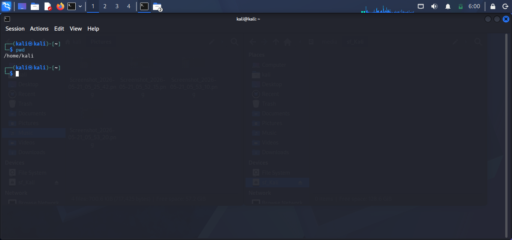

---

# 2. ls

## Meaning

`ls` is used to list the files and folders present in the current directory.

---

## Syntax

```bash
ls
```

---

## Example

```bash
ls
```

### Output Example

```bash
Desktop Documents Downloads Pictures Videos
```

---

## Screenshot

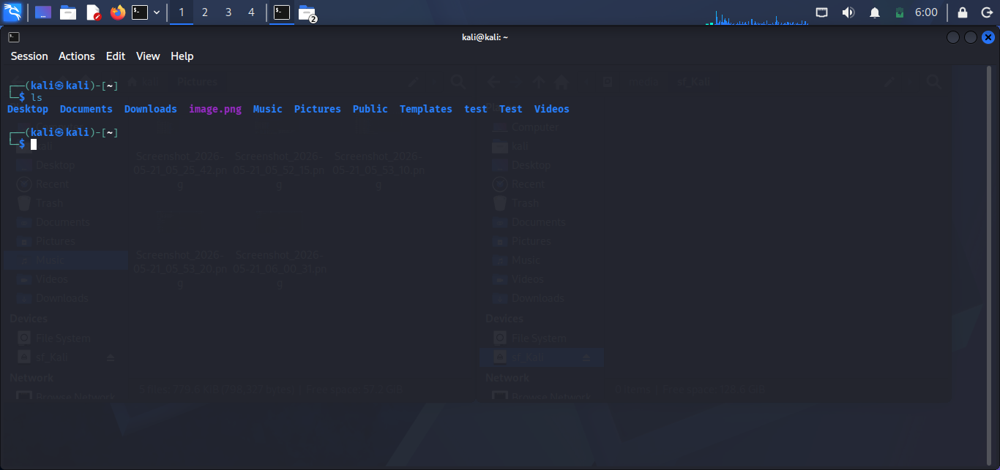

---

# 3. ls -l

## Meaning

`ls -l` displays files and folders in detailed list format.

It shows:
- file permissions
- owner
- file size
- timestamps

---

## Syntax

```bash
ls -l
```

---

## Example

```bash
ls -l
```

### Output Example

```bash
drwxr-xr-x 2 kali kali 4096 Desktop
-rw-r--r-- 1 kali kali 220 file.txt
```

---

## Screenshot

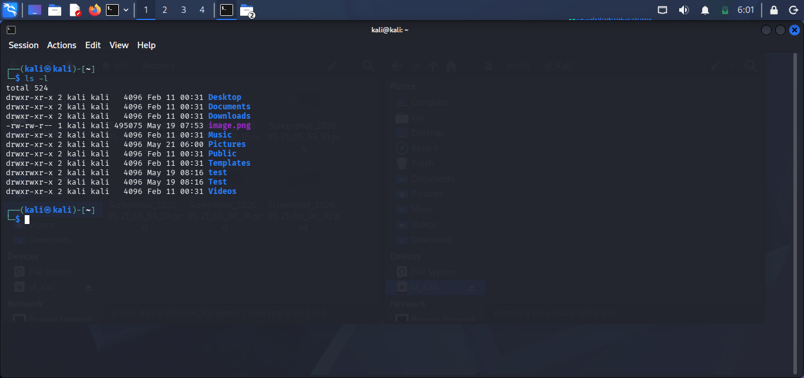

---

# 4. ls -a

## Meaning

`ls -a` is used to display all files including hidden files and folders.

Hidden files usually start with a dot (`.`).

---

## Syntax

```bash
ls -a
```

---

## Example

```bash
ls -a
```

### Output Example

```bash
.  ..  .bashrc  .profile  Desktop
```

---

## Screenshot

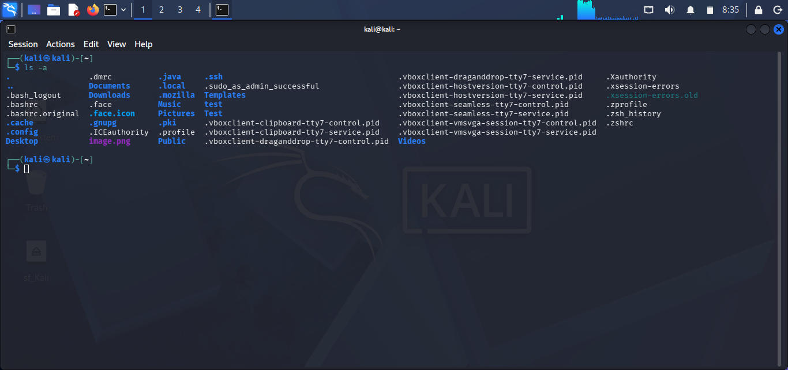

---

# 5. ls -la

## Meaning

`ls -la` combines:
- `ls -l` → detailed list format
- `ls -a` → hidden files

It displays:
- hidden files
- permissions
- owners
- timestamps
- detailed file information

---

## Syntax

```bash
ls -la
```

---

## Example

```bash
ls -la
```

### Output Example

```bash
drwxr-xr-x kali kali Desktop
-rw-r--r-- kali kali .bashrc
```

---

## Screenshot

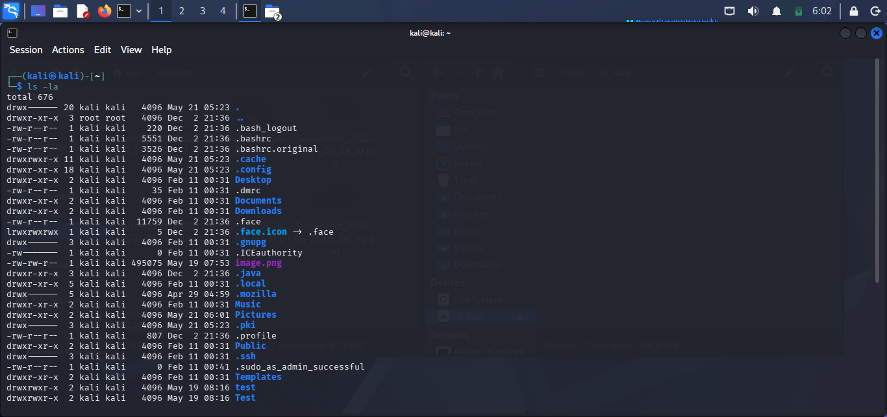

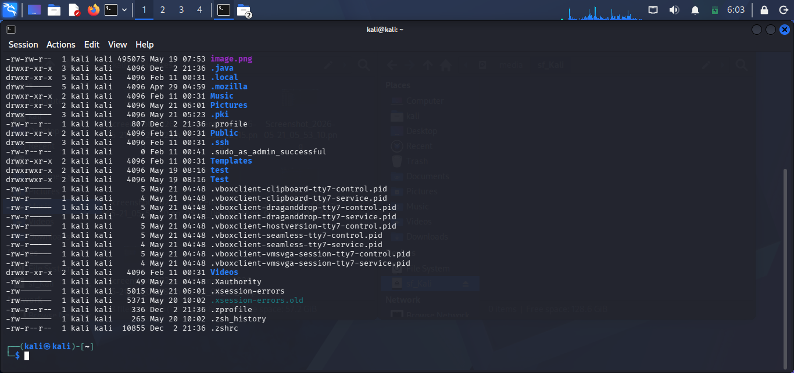

---

# 6. cd foldername

## Meaning

`cd` stands for **Change Directory**.

It is used to move into a specific folder.

---

## Syntax

```bash
cd foldername
```

---

## Example

```bash
cd Documents
pwd
```

### Output

```bash
/home/kali/Documents
```

---

## Screenshot

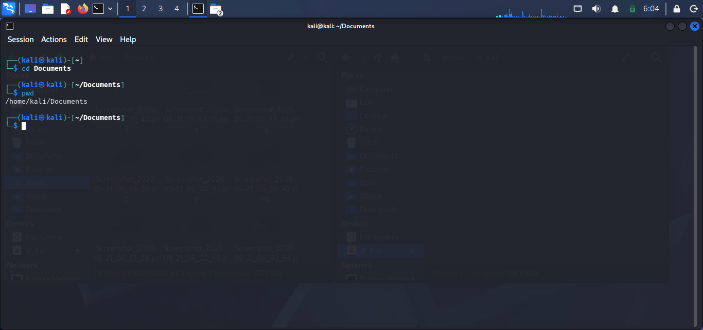

---

# 7. cd ..

## Meaning

`cd ..` is used to move back one directory/folder.

---

## Syntax

```bash
cd ..
```

---

## Example

```bash
cd ..
pwd
```

### Output

```bash
/home/kali
```

---

## Screenshot

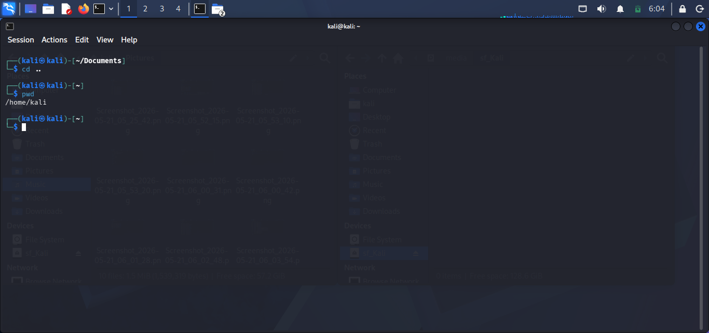

---

# 8. clear

## Meaning

`clear` is used to clear the terminal screen.

After executing the command, the terminal becomes empty and clean.

---

## Syntax

```bash
clear
```

---

## Example

```bash
clear
```

---

## Screenshot

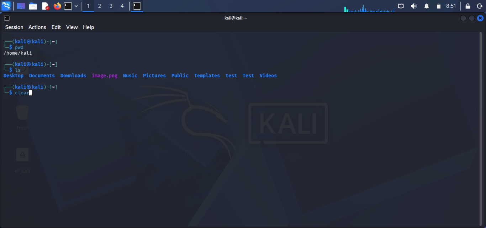

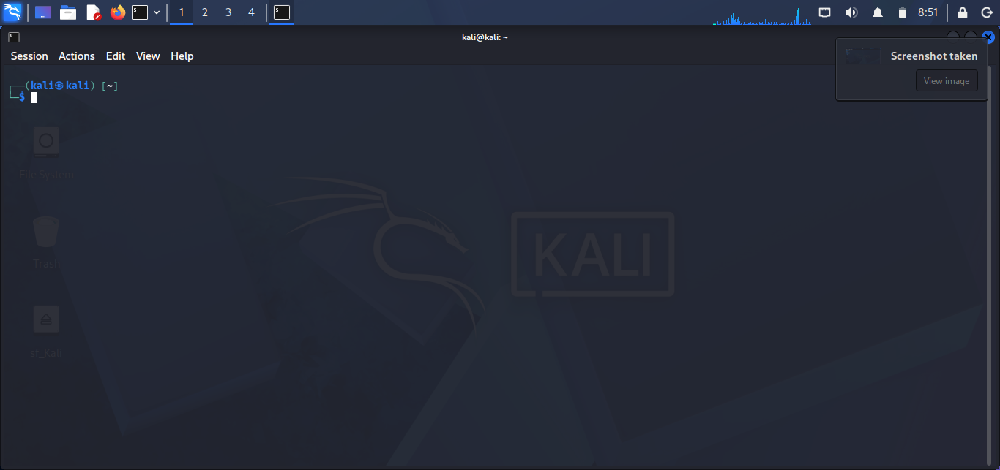

---

# 9. mkdir

## Meaning

`mkdir` stands for **Make Directory**.

It is used to create a new folder/directory.

---

## Syntax

```bash
mkdir foldername
```

---

## Example

```bash
mkdir test
```

---

## Verification

```bash
ls
```

### Output Example

```bash
Desktop Documents Downloads test
```

---

## Screenshot

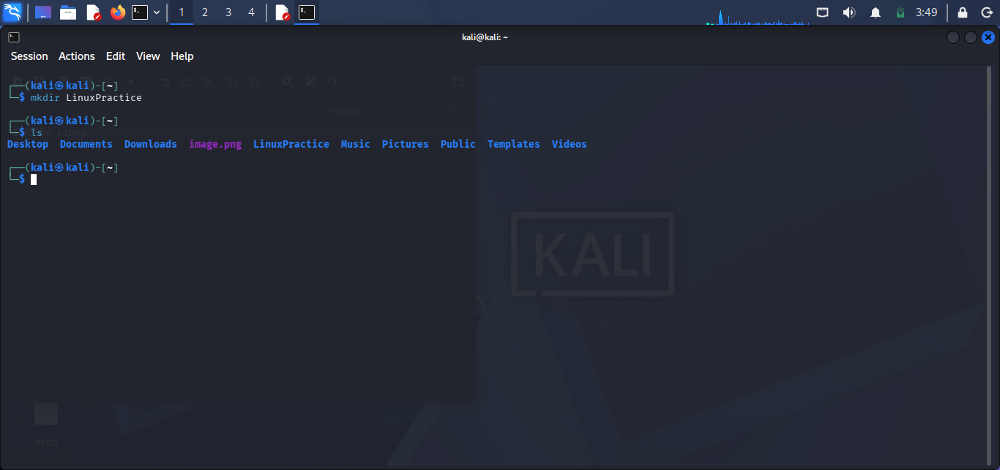

---

# 10. touch

## Meaning

`touch` is used to create a new empty file.

---

## Syntax

```bash
touch filename
```

---

## Example

```bash
touch file.txt
```

---

## Verification

```bash
ls
```

### Output Example

```bash
file.txt
```

---

## Screenshot

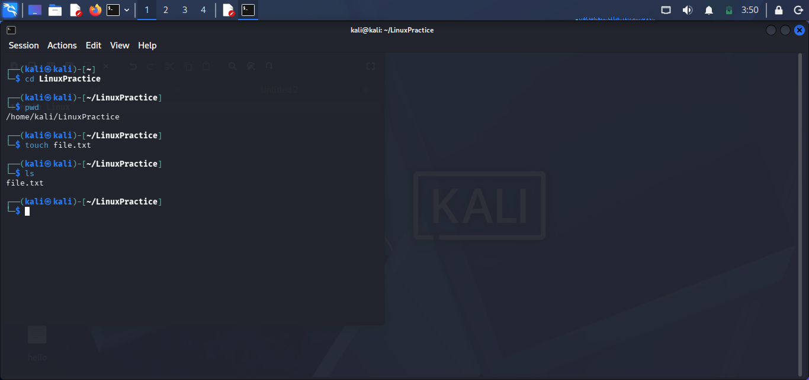

---

# 11. cp

## Meaning

`cp` stands for **Copy**.

It is used to copy files from one location to another.

---

## Syntax

```bash
cp sourcefile destinationfile
```

---

## Example

```bash
cp file.txt copy.txt
```

---

## Verification

```bash
ls
```

### Output Example

```bash
file.txt copy.txt
```

---

## Screenshot

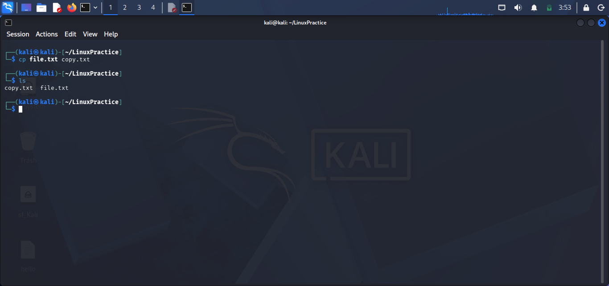

---

# 12. mv

## Meaning

`mv` stands for **Move**.

It is used to move or rename files and folders.

---

## Syntax

```bash
mv oldname newname
```

---

## Example

```bash
mv copy.txt newfile.txt
```

---

## Verification

```bash
ls
```

### Output Example

```bash
file.txt newfile.txt
```

---

## Screenshot


---

# 13. rm

## Meaning

`rm` stands for **Remove**.

It is used to delete files.

---

## Syntax

```bash
rm filename
```

---

## Example

```bash
rm newfile.txt
```

---

## Verification

```bash
ls
```

### Output Example

```bash
file.txt
```

---

## Screenshot

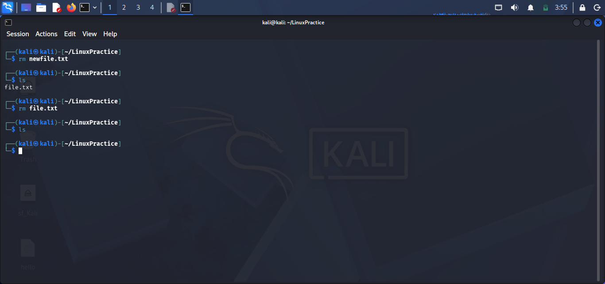

---

# 14. rm -r

## Meaning

`rm -r` is used to delete folders/directories recursively along with their contents.

---

## Syntax

```bash
rm -r foldername
```

---

## Example

```bash
rm -r test
```

---

## Verification

```bash
ls
```

### Output Example

```bash
Desktop Documents Downloads
```

---

## Screenshot

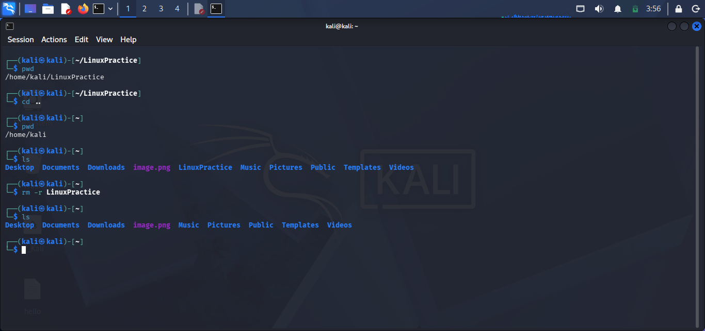

---

# 15. cat

## Meaning

`cat` stands for **Concatenate**.

It is used to view the contents of a file.

---

## Syntax

```bash
cat filename
```

---

## Example

```bash
echo "Hello Linux" > file.txt
cat file.txt
```

### Output

```bash
Hello Linux
```

---

## Screenshot

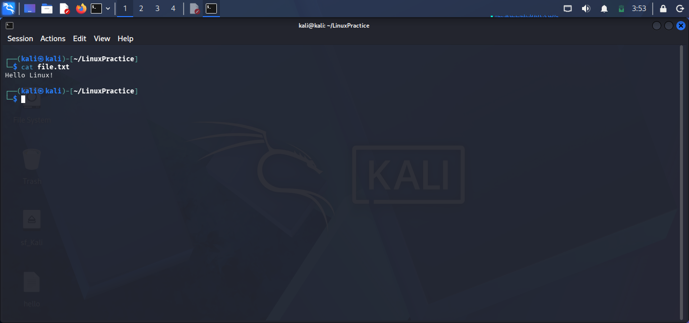

---

# 16. whoami

## Meaning

`whoami` is used to display the current logged-in username.

---

## Syntax

```bash
whoami
```

---

## Example

```bash
whoami
```

### Output

```bash
kali
```

---

## Screenshot

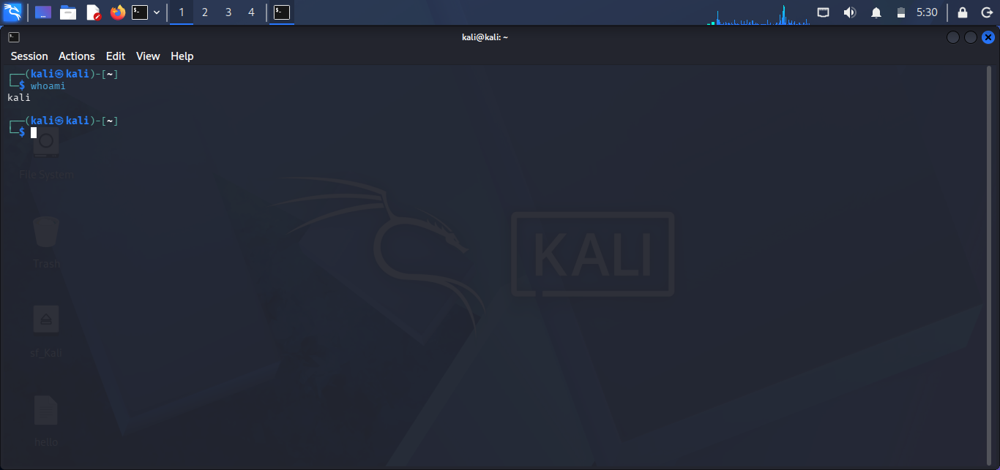

---

# 17. passwd

## Meaning

`passwd` is used to change the password of the current user account.

---

## Syntax

```bash
passwd
```

---

## Example

```bash
passwd
```

### Output Example

```bash
Changing password for kali
Current password:
New password:
Retype new password:
```

## Screenshot

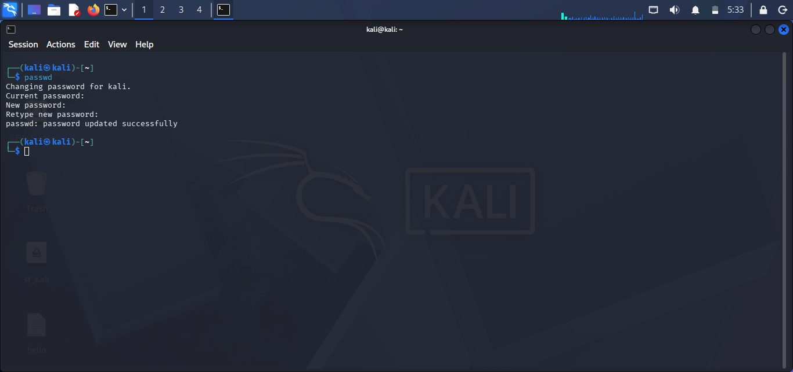

---

# 18. sudo

## Meaning

`sudo` stands for **Super User Do**.

It is used to run commands with administrator/root privileges.

---

## Syntax

```bash
sudo command
```

---

## Example

```bash
sudo apt update
```

### Output Example

```bash
[sudo] password for kali:
```

---

## Screenshot

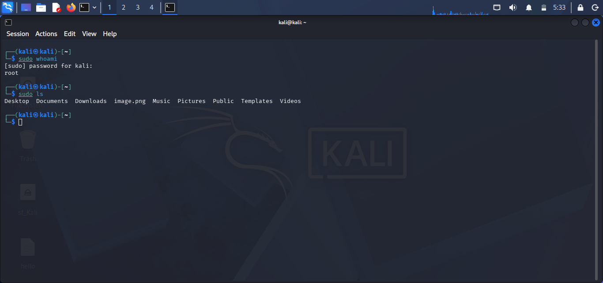

---

# 19. id

## Meaning

`id` is used to display detailed information about the current user such as:
- User ID (UID)
- Group ID (GID)
- Groups

---

## Syntax

```bash
id
```

---

## Example

```bash
id
```

### Output Example

```bash
uid=1000(kali) gid=1000(kali) groups=1000(kali)
```

---

## Screenshot

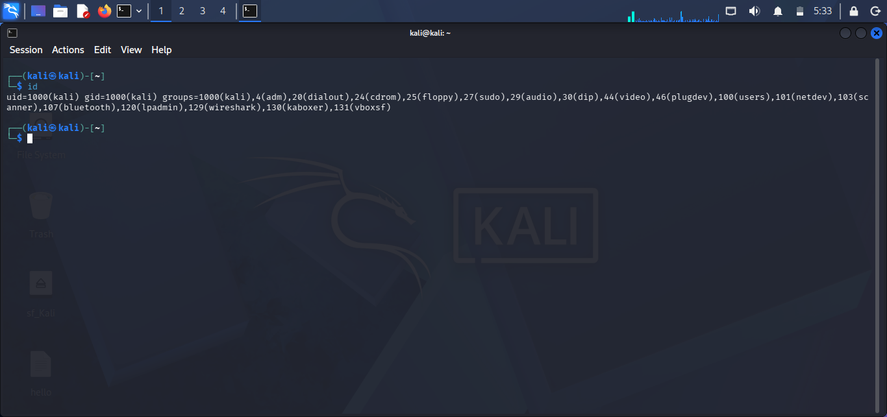

---

# 20. ip a

## Meaning

`ip a` is used to display IP addresses and network interface information.

---

## Syntax

```bash
ip a
```

---

## Example

```bash
ip a
```

### Output Example

```bash
inet 192.168.1.5/24
```

---

## Screenshot

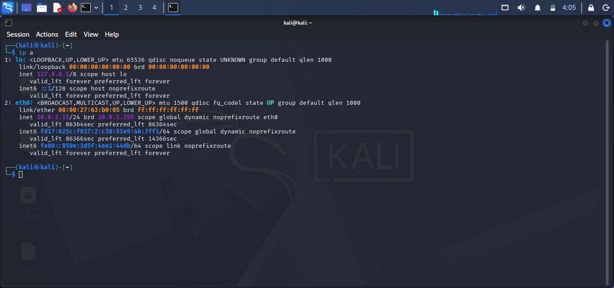

---

# 21. ping google.com

## Meaning

`ping` is used to check internet connectivity and test communication with another server.

---

## Syntax

```bash
ping google.com
```

---

## Example

```bash
ping google.com
```

### Output Example

```bash
64 bytes from google.com
```

> Press `Ctrl + C` to stop the ping command.

---

## Screenshot

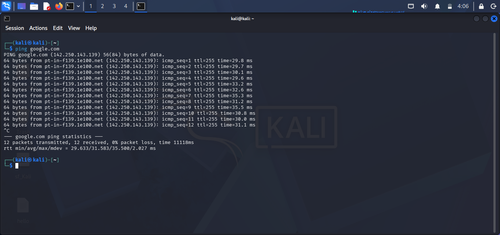

---

# 22. ifconfig

## Meaning

`ifconfig` is used to display network interface configuration details.

---

## Syntax

```bash
ifconfig
```

---

## Example

```bash
ifconfig
```

### Output Example

```bash
eth0: flags=4163<UP,BROADCAST,RUNNING,MULTICAST>
```

---

## Screenshot

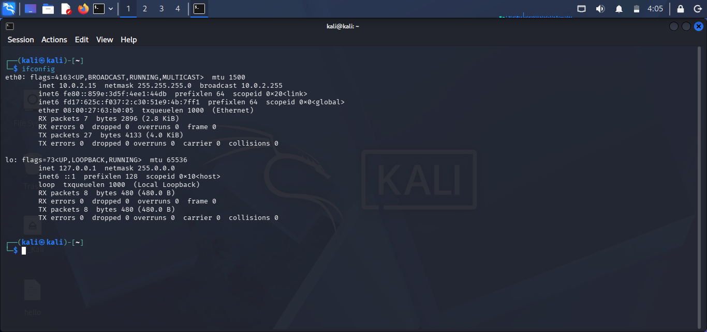

---

# 23. netstat -tulnp

## Meaning

`netstat -tulnp` is used to display:
- open ports
- active services
- listening connections
- process IDs

---

## Syntax

```bash
netstat -tulnp
```

---

## Example

```bash
netstat -tulnp
```

### Output Example

```bash
tcp LISTEN 0 128 0.0.0.0:22
```

> Some details may require `sudo` privileges.

---

## Screenshot

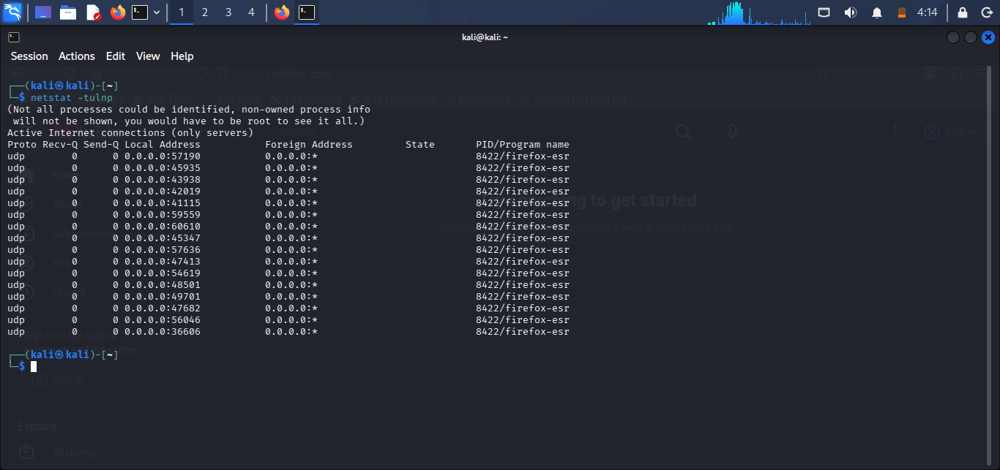

---

# 24. traceroute google.com

## Meaning

`traceroute` is used to display the path packets take from your system to a destination server.

---

## Syntax

```bash
traceroute google.com
```

---

## Example

```bash
traceroute google.com
```

### Output Example

```bash
1 192.168.1.1
2 * * *
```

---

## Screenshot

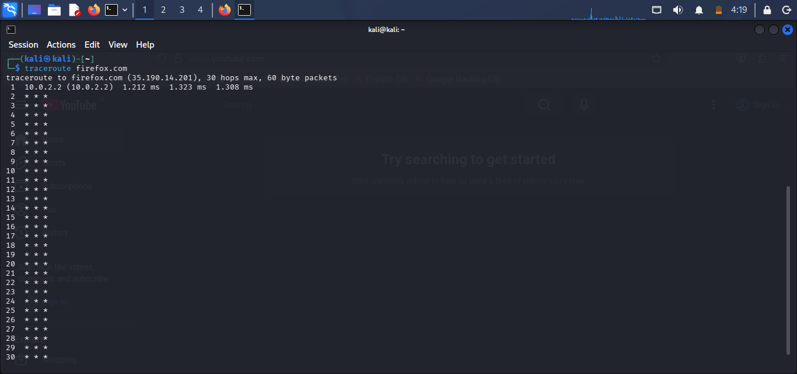

---

# 25. nslookup google.com

## Meaning

`nslookup` is used for DNS lookup and finding the IP address of a domain.

---

## Syntax

```bash
nslookup google.com
```

---

## Example

```bash
nslookup google.com
```

### Output Example

```bash
Address: 142.250.xxx.xxx
```

---

## Screenshot

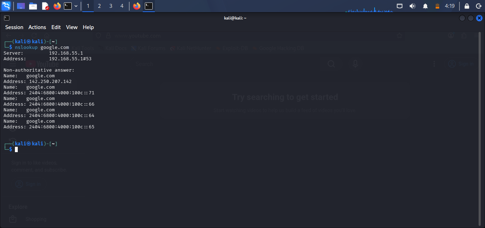

---

# 26. sudo apt update

## Meaning

`sudo apt update` updates the package list from repositories.

It checks:
- newest package versions
- available updates
- security updates

This command does **not** install updates.

Think of it as:

> "Check what updates are available."

---

## Syntax

```bash
sudo apt update
```

---

## Example

```bash
sudo apt update
```

### Output Example

```bash
Fetched 5 MB in 3s
Reading package lists... Done
```

---

## Screenshot

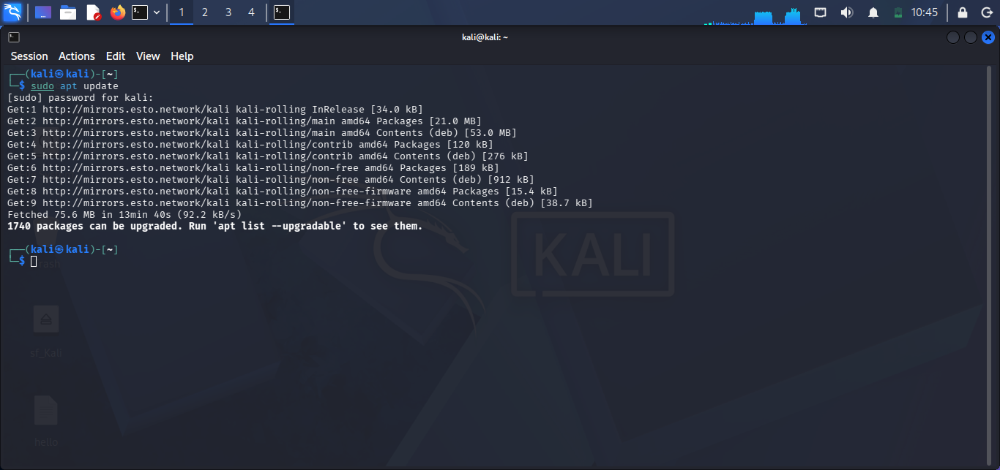

---

# 27. sudo apt upgrade

## Meaning

`sudo apt upgrade` upgrades installed packages to their latest available versions.

---

## Syntax

```bash
sudo apt upgrade
```

---

## Example

```bash
sudo apt upgrade
```

### Output Example

```bash
Do you want to continue? [Y/n]
```

---

## Screenshot

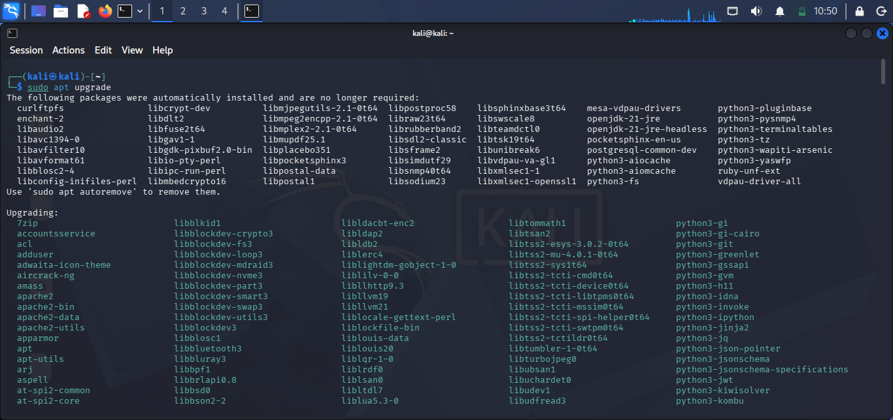

---

# 28. sudo apt install nmap

## Meaning

`sudo apt install` is used to install software packages from repositories.

---

## Syntax

```bash
sudo apt install package-name
```

---

## Example

```bash
sudo apt install nmap
```

### Output Example

```bash
The following NEW packages will be installed:
nmap
```

---

## Screenshot

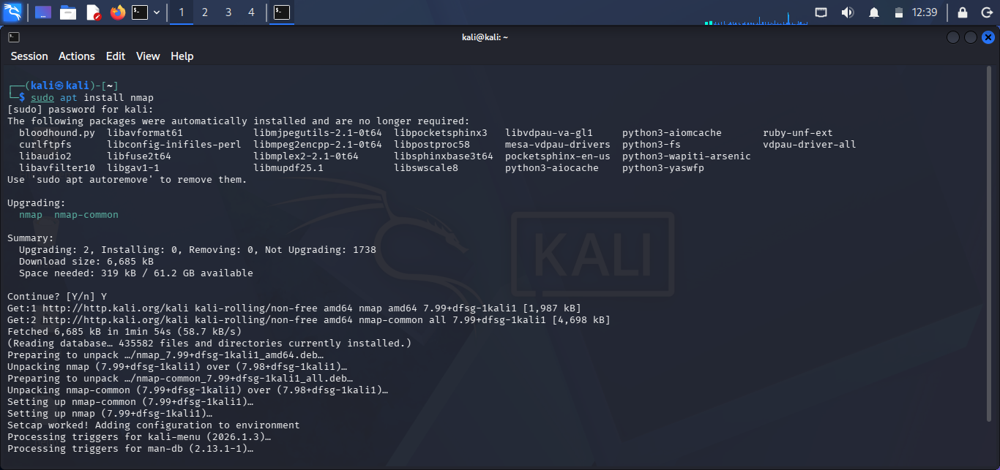

---

# 29. sudo apt remove nmap

## Meaning

`sudo apt remove` is used to uninstall software packages.

---

## Syntax

```bash
sudo apt remove package-name
```

---

## Example

```bash
sudo apt remove nmap
```

### Output Example

```bash
The following packages will be REMOVED:
nmap
```

---

## Screenshot

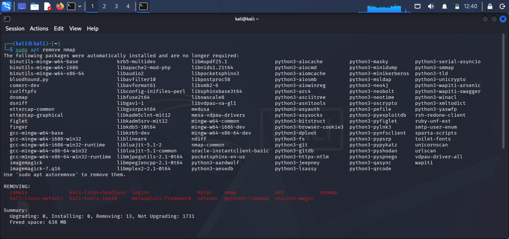

---

# Tools Used

- Kali Linux
- Oracle VirtualBox
- GitHub

---

# Skills Learned

- Linux terminal navigation
- File and directory management
- User management commands
- Linux networking basics
- Linux command usage
- Understanding hidden files and permissions
- Command-line interface practice
- Documentation using GitHub

---

# Project Structure

```text
Linux-Commands-Practice/
│
├── README.md
├── pwd-command.png
├── ls-command.png
├── ls-l-command.png
├── ls-a-command.png
├── ls-la-command-1.png
├── ls-la-command-2.png
├── cd-documents-command.png
├── cd-back-command.png
├── clear-command-1.png
├── clear-command-2.png
├── mkdir-command.png
├── touch-command.png
├── cp-command.png
├── mv-command.png
├── rm-command.png
├── rm-r-command.png
├── cat-command.png
├── whoami-command.png
├── passwd-command.png
├── sudo-command.png
├── id-command.png
├── ip-a-command.png
├── ping-command.png
├── ifconfig-command.png
├── netstat-command.png
├── traceroute-command.png
├── nslookup-command.png
├── apt-update-command.png
├── apt-upgrade-command.png
├──apt-install-command.png
└── apt-remove-command.png

```

---

# Future Improvements

- Add more Linux commands
- Practice file permissions
- Learn networking commands
- Explore shell scripting basics
- Document advanced Linux usage

---

# Author

**Tejaswani Animireddy**
